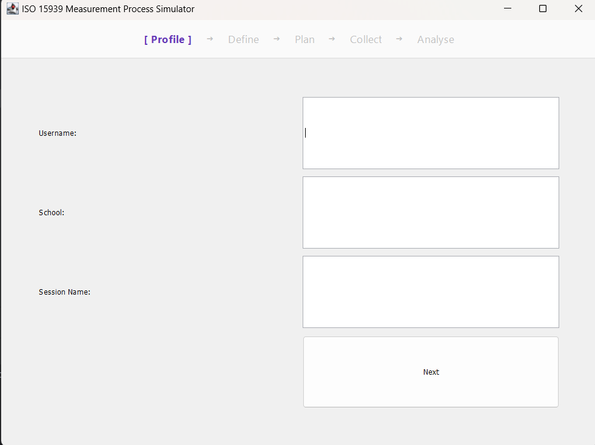

# SENG 272 - Software Measurement Simulator

Name: Bahar Nisa Tuğrul

ID: 202328056

An interactive desktop simulator based on the ISO/IEC 15939 standard. Built with Java Swing, it features a 5-step wizard and a custom Java 2D radar chart for software quality analysis.

Compile & Run: This project runs on standard Java SE with no external dependencies.

Compile: javac src/*.java -d out

Run: java -cp out Main

5-Step Measurement Process

Step 1: Profile — User authentication and metadata initialization (Name, School, Session).
  
  

Step 2: Define — Scope selection (Product/Process Quality) and operational mode (Education/Enterprise).
  
  

Step 3: Plan — Mapping dimensions to metrics, including target directions and units.
  
  

Step 4: Collect — Loading and entering realistic default datasets tailored to the active mode.
  
  

Step 5: Analyse — Dynamic Java 2D Radar Chart and Gap Analysis utilizing S/D scenario boundaries and 0.5 interval rounding.
  
  
