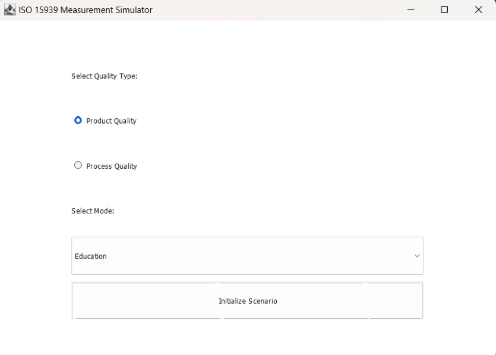
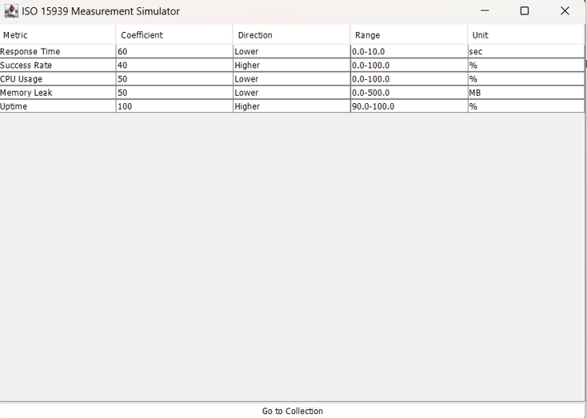
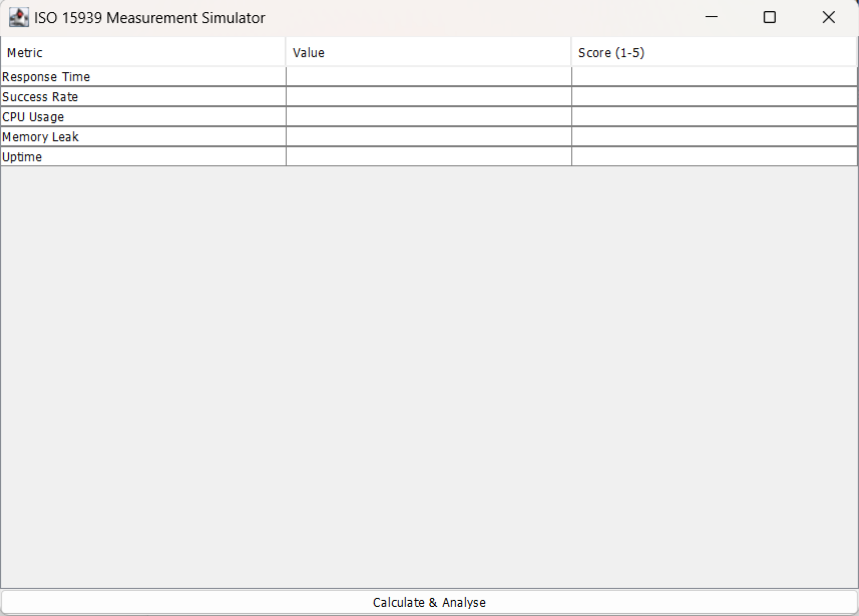
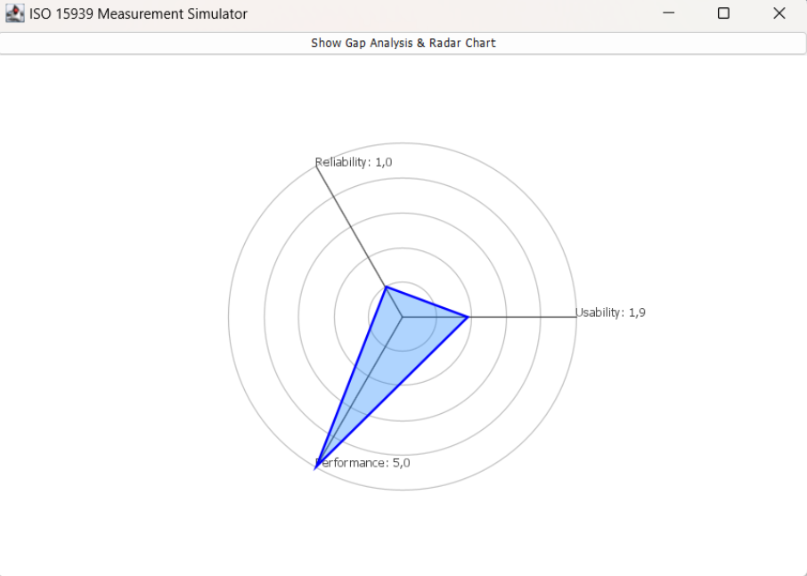

# SENG 272 - Software Measurement Simulator
An interactive desktop simulator based on the ISO/IEC 15939 standard. Built with Java Swing, it features a 5-step wizard and a custom Java 2D radar chart for software quality analysis.

Name: Bahar Nisa Tuğrul
ID: 202328056

How to Compile & Run
This project runs on standard Java SE with no external dependencies.

Compile: javac src/*.java -d out
Run: java -cp out Main

Step 1: Profile Screen

Step 2: Define Screen

Step 3: Plan Screen

Step 4: Collect Screen

Step 5: Analyse Screen (Radar Chart)

